# תרשים Use Case - מערכת Aruroa

## תיאור Actors (משתמשים)
1. **אורח (Guest)** - משתמש לא מחובר
2. **משתמש רגיל (Registered User)** - משתמש מחובר
3. **מנהל מערכת (Admin)** - משתמש עם הרשאות מנהל
4. **מערכת חיצונית (External System)** - MySQL Database

---

## תרשים Use Case בפורמט טקסטואלי

```
┌─────────────────────────────────────────────────────────────────────────────┐
│                          מערכת Aruroa - ניהול מוזיקה                        │
└─────────────────────────────────────────────────────────────────────────────┘

┌──────────┐                                                        ┌──────────┐
│          │                                                        │          │
│  אורח    │                                                        │  מנהל    │
│ (Guest)  │                                                        │ (Admin)  │
│          │                                                        │          │
└────┬─────┘                                                        └────┬─────┘
     │                                                                   │
     │  ┌─────────────────────────────────────────────────────────┐    │
     │  │                                                         │    │
     ├──┤ UC1: צפייה בשירים                                      │    │
     │  │                                                         │    │
     │  └─────────────────────────────────────────────────────────┘    │
     │                                                                   │
     │  ┌─────────────────────────────────────────────────────────┐    │
     │  │                                                         │    │
     ├──┤ UC2: חיפוש שירים                                       │    │
     │  │      «include» → סינון לפי ז'אנר                       │    │
     │  └─────────────────────────────────────────────────────────┘    │
     │                                                                   │
     │  ┌─────────────────────────────────────────────────────────┐    │
     │  │                                                         │    │
     ├──┤ UC3: הרשמה למערכת                                      │    │
     │  │                                                         │    │
     │  └─────────────────────────────────────────────────────────┘    │
     │                                                                   │
     │  ┌─────────────────────────────────────────────────────────┐    │
     │  │                                                         │    │
     ├──┤ UC4: התחברות למערכת                                    │    │
     │  │                                                         │    │
     │  └─────────────────────────────────────────────────────────┘    │
     │                                                                   │
     │                                                                   │
┌────┴─────┐                                                             │
│          │                                                             │
│ משתמש    │                                                             │
│  רגיל    │                                                             │
│ (User)   │                                                             │
└────┬─────┘                                                             │
     │                                                                   │
     │  ┌─────────────────────────────────────────────────────────┐    │
     │  │                                                         │    │
     ├──┤ UC5: העלאת שיר                                          ├────┤
     │  │      «include» → קריאת מטא-דאטה                        │    │
     │  │      «include» → בחירת ז'אנרים                         │    │
     │  └─────────────────────────────────────────────────────────┘    │
     │                                                                   │
     │  ┌─────────────────────────────────────────────────────────┐    │
     │  │                                                         │    │
     ├──┤ UC6: השמעת שיר                                          ├────┤
     │  │      «extend» → הוספה לתור                             │    │
     │  │      «include» → עדכון מונה השמעות                     │    │
     │  └─────────────────────────────────────────────────────────┘    │
     │                                                                   │
     │  ┌─────────────────────────────────────────────────────────┐    │
     │  │                                                         │    │
     ├──┤ UC7: דירוג שיר (1-5 כוכבים)                            ├────┤
     │  │      «include» → חישוב דירוג ממוצע                     │    │
     │  └─────────────────────────────────────────────────────────┘    │
     │                                                                   │
     │  ┌─────────────────────────────────────────────────────────┐    │
     │  │                                                         │    │
     ├──┤ UC8: יצירת פלייליסט                                     ├────┤
     │  │      «extend» → הגדרה כציבורי/פרטי                      │    │
     │  └─────────────────────────────────────────────────────────┘    │
     │                                                                   │
     │  ┌─────────────────────────────────────────────────────────┐    │
     │  │                                                         │    │
     ├──┤ UC9: ניהול פלייליסט                                     ├────┤
     │  │      «include» → הוספת שיר לפלייליסט                   │    │
     │  │      «include» → הסרת שיר מפלייליסט                     │    │
     │  │      «extend» → שינוי סדר שירים                         │    │
     │  └─────────────────────────────────────────────────────────┘    │
     │                                                                   │
     │  ┌─────────────────────────────────────────────────────────┐    │
     │  │                                                         │    │
     ├──┤ UC10: השמעת פלייליסט                                    ├────┤
     │  │       «include» → טעינת שירים לתור                      │    │
     │  └─────────────────────────────────────────────────────────┘    │
     │                                                                   │
     │  ┌─────────────────────────────────────────────────────────┐    │
     │  │                                                         │    │
     ├──┤ UC11: ניהול פרופיל אישי                                 ├────┤
     │  │       «include» → העלאת תמונת פרופיל                    │    │
     │  │       «include» → צפייה בסטטיסטיקות                    │    │
     │  └─────────────────────────────────────────────────────────┘    │
     │                                                                   │
     │  ┌─────────────────────────────────────────────────────────┐    │
     │  │                                                         │    │
     ├──┤ UC12: מחיקת שיר שלי                                     ├────┤
     │  │       «include» → בדיקת הרשאות                          │    │
     │  └─────────────────────────────────────────────────────────┘    │
     │                                                                   │
     │  ┌─────────────────────────────────────────────────────────┐    │
     │  │                                                         │    │
     ├──┤ UC13: בקשה לז'אנר חדש                                   ├────┤
     │  │       «include» → שמירת בקשה במערכת                     │    │
     │  └─────────────────────────────────────────────────────────┘    │
     │                                                                   │
     │  ┌─────────────────────────────────────────────────────────┐    │
     │  │                                                         │    │
     ├──┤ UC14: צפייה בפלייליסטים ציבוריים                       ├────┤
     │  │                                                         │    │
     │  └─────────────────────────────────────────────────────────┘    │
     │                                                                   │
     │                                                                   │
     │                                                                   │
     │                                                              ┌────┴─────┐
     │                                                              │          │
     │                                                              │  מנהל    │
     │                                                              │ (Admin)  │
     │                                                              │          │
     │                                                              └────┬─────┘
     │                                                                   │
     │  ┌─────────────────────────────────────────────────────────┐    │
     │  │                                                         │    │
     │  │ UC15: צפייה בלוח בקרה                                   │◄───┤
     │  │       «include» → סטטיסטיקות מערכת                      │    │
     │  │       «include» → שירים פופולריים                       │    │
     │  └─────────────────────────────────────────────────────────┘    │
     │                                                                   │
     │  ┌─────────────────────────────────────────────────────────┐    │
     │  │                                                         │    │
     │  │ UC16: ניהול משתמשים                                     │◄───┤
     │  │       «include» → צפייה בכל המשתמשים                    │    │
     │  │       «extend» → מחיקת משתמש                            │    │
     │  │       «extend» → שינוי הרשאות                           │    │
     │  └─────────────────────────────────────────────────────────┘    │
     │                                                                   │
     │  ┌─────────────────────────────────────────────────────────┐    │
     │  │                                                         │    │
     │  │ UC17: ניהול כל השירים                                   │◄───┤
     │  │       «include» → מחיקת שיר כלשהו                       │    │
     │  │       «extend» → עריכת מטא-דאטה                         │    │
     │  └─────────────────────────────────────────────────────────┘    │
     │                                                                   │
     │  ┌─────────────────────────────────────────────────────────┐    │
     │  │                                                         │    │
     │  │ UC18: ניהול ז'אנרים                                     │◄───┤
     │  │       «include» → הוספת ז'אנר                           │    │
     │  │       «include» → עריכת ז'אנר                           │    │
     │  │       «extend» → מחיקת ז'אנר                            │    │
     │  └─────────────────────────────────────────────────────────┘    │
     │                                                                   │
     │  ┌─────────────────────────────────────────────────────────┐    │
     │  │                                                         │    │
     │  │ UC19: ניהול בקשות ז'אנרים                               │◄───┤
     │  │       «include» → צפייה בבקשות ממתינות                  │    │
     │  │       «extend» → אישור בקשה                             │    │
     │  │       «extend» → דחיית בקשה                             │    │
     │  └─────────────────────────────────────────────────────────┘    │
     │                                                                   │
     │                                                                   │
     │                                                                   │
     │                    ┌──────────────────────┐                      │
     │                    │                      │                      │
     └────────────────────┤  MySQL Database      │◄─────────────────────┘
                          │  (External System)   │
                          │                      │
                          └──────────────────────┘
```

---

## טבלת Use Cases מפורטת

| מספר | Use Case | Actor | תיאור קצר | קדימות |
|------|----------|-------|-----------|--------|
| UC1 | צפייה בשירים | אורח, משתמש, מנהל | הצגת רשימת כל השירים במערכת | גבוהה |
| UC2 | חיפוש שירים | אורח, משתמש, מנהל | חיפוש לפי שם וסינון לפי ז'אנרים | גבוהה |
| UC3 | הרשמה למערכת | אורח | יצירת חשבון משתמש חדש | גבוהה |
| UC4 | התחברות למערכת | אורח | כניסה למערכת עם שם משתמש וסיסמה | גבוהה |
| UC5 | העלאת שיר | משתמש, מנהל | העלאת קובץ אודיו למערכת | גבוהה |
| UC6 | השמעת שיר | משתמש, מנהל | נגינת שיר בנגן הגלובלי | גבוהה |
| UC7 | דירוג שיר | משתמש, מנהל | מתן דירוג 1-5 כוכבים לשיר | בינונית |
| UC8 | יצירת פלייליסט | משתמש, מנהל | יצירת פלייליסט חדש (פרטי/ציבורי) | גבוהה |
| UC9 | ניהול פלייליסט | משתמש, מנהל | הוספה/הסרה של שירים מפלייליסט | גבוהה |
| UC10 | השמעת פלייליסט | משתמש, מנהל | נגינת כל השירים בפלייליסט | בינונית |
| UC11 | ניהול פרופיל אישי | משתמש, מנהל | עריכת פרטים אישיים וצפייה בסטטיסטיקות | בינונית |
| UC12 | מחיקת שיר שלי | משתמש, מנהל | מחיקת שיר שהמשתמש העלה | בינונית |
| UC13 | בקשה לז'אנר חדש | משתמש, מנהל | שליחת בקשה להוספת ז'אנר חדש | נמוכה |
| UC14 | צפייה בפלייליסטים ציבוריים | משתמש, מנהל | גלישה בפלייליסטים של משתמשים אחרים | בינונית |
| UC15 | צפייה בלוח בקרה | מנהל | סטטיסטיקות כלליות של המערכת | גבוהה |
| UC16 | ניהול משתמשים | מנהל | צפייה, מחיקה ושינוי הרשאות משתמשים | גבוהה |
| UC17 | ניהול כל השירים | מנהל | מחיקה ועריכה של כל השירים במערכת | גבוהה |
| UC18 | ניהול ז'אנרים | מנהל | הוספה, עריכה ומחיקה של ז'אנרים | בינונית |
| UC19 | ניהול בקשות ז'אנרים | מנהל | אישור או דחייה של בקשות משתמשים | בינונית |

---

## הסברים:

### יחסים בין Use Cases:

**«include»** - תהליך שחייב להתבצע תמיד:
- חיפוש שירים → סינון לפי ז'אנר
- העלאת שיר → קריאת מטא-דאטה
- השמעת שיר → עדכון מונה השמעות

**«extend»** - תהליך אופציונלי:
- השמעת שיר → הוספה לתור (אופציה)
- יצירת פלייליסט → הגדרה כציבורי/פרטי
- ניהול משתמשים → מחיקת משתמש (לא תמיד)

### הרשאות:
- **אורח**: רק צפייה וחיפוש
- **משתמש רגיל**: כל הפעולות הבסיסיות
- **מנהל**: כל ההרשאות + ניהול מערכת

---

## תרשים Use Case בפורמט Mermaid (לייצוא לתמונה)

```mermaid
graph TB
    Guest[אורח]
    User[משתמש רגיל]
    Admin[מנהל]
    
    UC1[UC1: צפייה בשירים]
    UC2[UC2: חיפוש שירים]
    UC3[UC3: הרשמה]
    UC4[UC4: התחברות]
    UC5[UC5: העלאת שיר]
    UC6[UC6: השמעת שיר]
    UC7[UC7: דירוג שיר]
    UC8[UC8: יצירת פלייליסט]
    UC9[UC9: ניהול פלייליסט]
    UC10[UC10: השמעת פלייליסט]
    UC11[UC11: ניהול פרופיל]
    UC12[UC12: מחיקת שיר שלי]
    UC13[UC13: בקשה לז'אנר]
    UC14[UC14: פלייליסטים ציבוריים]
    UC15[UC15: לוח בקרה]
    UC16[UC16: ניהול משתמשים]
    UC17[UC17: ניהול שירים]
    UC18[UC18: ניהול ז'אנרים]
    UC19[UC19: ניהול בקשות ז'אנרים]
    
    Guest --> UC1
    Guest --> UC2
    Guest --> UC3
    Guest --> UC4
    
    User --> UC1
    User --> UC2
    User --> UC5
    User --> UC6
    User --> UC7
    User --> UC8
    User --> UC9
    User --> UC10
    User --> UC11
    User --> UC12
    User --> UC13
    User --> UC14
    
    Admin --> UC1
    Admin --> UC2
    Admin --> UC5
    Admin --> UC6
    Admin --> UC7
    Admin --> UC8
    Admin --> UC9
    Admin --> UC10
    Admin --> UC11
    Admin --> UC12
    Admin --> UC13
    Admin --> UC14
    Admin --> UC15
    Admin --> UC16
    Admin --> UC17
    Admin --> UC18
    Admin --> UC19
```



---

## איך להמיר ל-PNG:
1. העתק את קוד ה-Mermaid
2. גש ל-https://mermaid.live
3. הדבק את הקוד
4. ייצא כ-PNG או SVG
